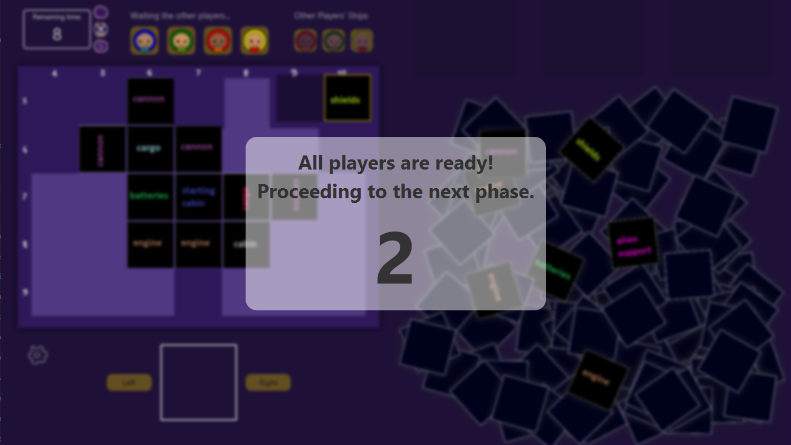
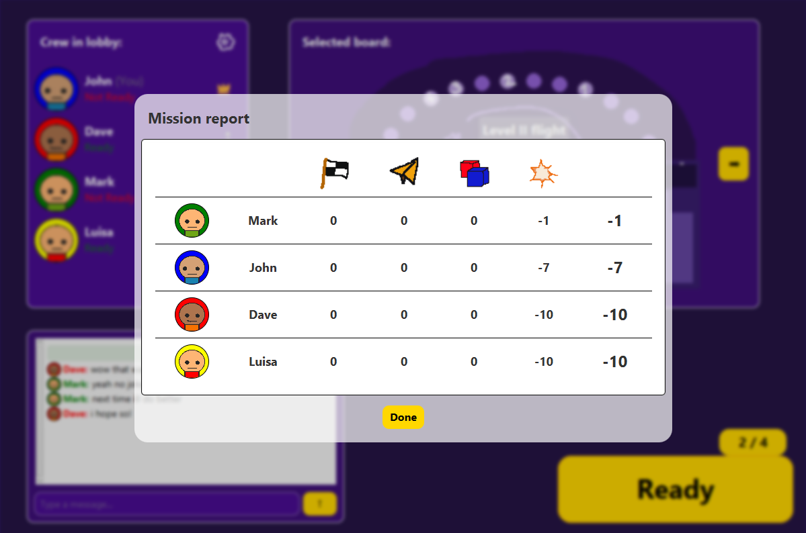

# Java LAN Multiplayer Game

> ⚠️ **Note:** This repository is a public adaptation of a university project originally developed for a Software Engineering course.  
> All proprietary assets (images, graphics, etc.) from the original game have been removed for copyright reasons and replaced with simple placeholder graphics.  
> The game is therefore not fully representative of the original visual experience, and this version is provided only as an educational example of a Java LAN multiplayer implementation.

## Project Overview

This project was initially developed as a final university project in Java.  
It demonstrates a client-server structure for LAN multiplayer games, including components for resource management and game logic.

The focus of this repository is to illustrate:

- Java networking (TCP sockets)
- Client-server architecture
- Multiplayer synchronization over LAN
- Object-oriented design in Java
- Maven project structure

### Original Team
- Michele Garolini
- Michael Jafari
- Cesario Migliaccio


## Screenshots

*Note: Original graphical assets were removed due to copyright restrictions and replaced with simple placeholder graphics.*

### Ship Building Phase


### Mission Report


## Architecture

The application follows a client-server architecture.

- The server maintains the authoritative game state
- clients connect via TCP sockets
- game actions are transmitted using a custom application protocol
- the server broadcasts state updates to all connected clients

Further implementation details are available in the project documentation.

## How to Compile with Maven

To compile the project using Maven:

1. Ensure Maven is installed: [Maven official website](https://maven.apache.org/download.cgi)
2. Navigate to the root directory containing `pom.xml`.
3. Run:

```bash
mvn clean package
```

This command will generate a main JAR inside the `target` folder

## How to Run the Program

You can run the program using the compiled JAR file:

### Running the Server

```bash
    java -jar java-lan-multiplayer-game-x.x.jar server [options]
```

### Running the Client

```bash
    java -jar java-lan-multiplayer-game-x.x.jar client [options]
```

## Server CLI Arguments

| Argument        | Description                              | Accepted Values          | Default Value |
|-----------------|------------------------------------------|--------------------------|---------------|
| `--port`, `-p`  | TCP port the server listens on.          | Any valid port (0–65535) | 8080          |
| `--debug`, `-d` | Enables debug mode with verbose logging. | (flag only)              | Off           |

## Client CLI Arguments

| Argument        | Description                              | Accepted Values | Default Value |
|-----------------|------------------------------------------|-----------------|---------------|
| `--lang`, `-l`  | Sets the client UI language.             | `en`, `it`      | `en`          |
| `--debug`, `-d` | Enables debug mode with verbose logging. | (flag only)     | Off           |

## Documentation

Additional technical documentation is available:

- [Communication Protocol](docs/communication_protocol.md)
- [Low-Level UML Diagram](docs/uml_low_level.png)

## Testing

The project includes 100+ automated tests covering core game logic and networking components.

Tests can be executed with:

```bash
mvn test
```

## Legal Disclaimer

This project is a personal, educational implementation and does not include any proprietary assets from the original game.
It is provided for learning and demonstration purposes only. No part of the original game’s images, graphics, or commercial content is included.