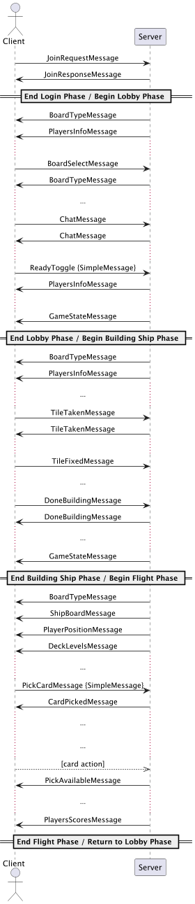

# Communication Protocol – Technical Documentation

> ⚠️ **Note:** This document describes the communication protocol implemented for the **Java LAN Multiplayer Game**, a personal educational project derived from a university assignment.  
> All proprietary assets have been removed. The game is **not fully playable**; this document serves as an educational example of a client-server architecture and message handling in Java.

1. Introduction
2. System Architecture
3. Protocol Description
    1. Type of Protocol
    2. Message Structure
4. Protocol Extensibility
5. Complete Session Examples
6. Java Classes Used for Messages

## 1. Introduction

This document describes the communication protocol implemented for the **Java LAN Multiplayer Game**, a Java project designed to illustrate a multiplayer client-server architecture.

The game demonstrates players interacting via a networked system, sending actions to a server that manages the game state.  

The server centralizes the game logic, hosts the game model and controller, and manages the overall game flow. Clients act as user interfaces through which players send actions and receive updates from the server.

The goal of this document is to provide a detailed description of the communication structure between client and server, with particular focus on:

- the format and contents of exchanged messages,
- the sequence of interactions during different game phases,
- error handling,
- protocol extensibility.

## 2. System Architecture

The system follows a client-server architecture, where the server acts as the central coordinator and manages the game logic, while the clients serve as user interfaces.

Clients connect to the server via a TCP connection and do not communicate directly with each other. Each client interacts exclusively with the server, which receives player actions, processes them, and sends back updates about the game state.

### Main Components

**Server**

- GameModel: Contains the current game state and all objects needed to represent a match.
- Controller: Manages logic for actions sent by clients and updates the model accordingly.
- EventDispatcher: Notification system responsible for propagating events to client interfaces.
- VirtualView: One per connected client, acts as an interface between the game model and the remote client.

**Client**

- Graphical Interface (JavaFX): Allows the user to interact with the game intuitively.
- VirtualServer: Manages the connection to the server and message sending/receiving.
- Controller: Coordinates logic between the graphical interface (JavaFX) and the VirtualServer. It handles user inputs, updates the view based on events received from the server, and translates user actions into messages to send to the server. It acts as a mediator between model and view.

### Technologies Used

- Language: Java
- Communication Protocol: TCP
- Message Format: Serialized Java objects (JSON)
- Multi-threading: Each client is managed by a dedicated thread on the server side
- GUI Libraries: JavaFX

## 3. Protocol Description

### 3.1 Type of Protocol

The system uses a TCP-based communication protocol implemented via Java Sockets. This ensures reliable and ordered data transmission, which is essential for proper synchronization between clients and server.

Communication on the client side is asynchronous: each client can send multiple consecutive messages to the server without waiting for an immediate response, thanks to an input buffer on the server that handles incoming messages. This approach improves UI responsiveness.

The server does not send unsolicited messages to clients, except for a heartbeat mechanism used to monitor active connections.

The TCP connection remains open for the duration of the session. If disconnected, the system supports client reconnection.

Messages are serialized Java objects exchanged between client and server.

### 3.2 Message Structure

All messages implement a common interface `GameMessage`, which defines `getType()` to identify the message type. This supports extensibility and simplifies message handling.

Messages are serialized into JSON using the Jackson library.

Here are some examples:

#### JoinRequestMessage

- Direction: Client → Server
- Purpose: Sends information about a player joining the lobby.
- Fields:
  - username: String – Player’s name
  - profilePicIds: int[] – Profile avatar identifiers
  - color: String – Chosen player color
  - admin: boolean – true if the player is the host
  - ready: boolean – true if the player is marked as ready
  - type: join_request

```json
{
   "type": "join_request",
   "username": "Player1",
   "profilePicIds": [1, 4],
   "color": "RED",
   "admin": true,
   "ready": false
}
````

#### JoinResponseMessage

* Direction: Server → Client
* Purpose: Informs the client about the result of the lobby join request.
* Fields:

    * joinStatus: JoinStatus (enum: SUCCESS, LOBBY_FULL, NAME_TAKEN, GAME_STARTED)
    * type: join_response

```json
{
   "type": "join_response",
   "joinStatus": "SUCCESS"
}
```

#### GameStateMessage

* Direction: Server → Client
* Purpose: Sends the current game state to the client.
* Fields:

    * gameState: GameModel.GameState – Serialized game state object
    * type: game_state

```json
{
   "gameState": "BUILDING_PHASE",
   "type": "game_state"
}
```

#### SimplePlayerMessage

* Direction: Variable (Server ↔ Client)
* Purpose: Generic message notifying events involving a single player.
* Fields:

    * type: String – Message type (e.g., “ready_toggle”, “ping”)
    * playerName: String – Name of the player involved

```json
{
   "type": "ready_toggle",
   "playerName": "Player1"
}
```

## 4. Protocol Extensibility

The protocol is designed for extension and version tolerance.

### Adding New Messages

1. Create a new class implementing `GameMessage`.
2. Implement `getType()` with a unique identifier.
3. Update dispatcher/event handler if necessary.

Jackson allows dynamic instantiation of messages, so core parsing does not require modification.

### Behavior with Unknown Messages

Unknown fields are ignored (`@JsonIgnoreProperties(ignoreUnknown = true)`), and unrecognized message types are discarded without errors.

## 5. Complete Session Example

Example of message exchange:



## 6. Java Classes Used for Messages

### sendMessage

```java
public void sendMessage(GameMessage message) {
    ObjectMapper mapper = new ObjectMapper();
    String json;
    try {
        json = mapper.writeValueAsString(message);
    } catch (JsonProcessingException e) {
        throw new RuntimeException(e);
    }
    this.out.println(json);
}
```

* Works with any `GameMessage` class.
* Uses JSON for interoperability.
* Serialization errors are explicitly handled.

#### Dependencies

```xml
<!-- Jackson -->
<dependency>
  <groupId>com.fasterxml.jackson.core</groupId>
  <artifactId>jackson-databind</artifactId>
  <version>2.17.0</version>
</dependency>
<dependency>
  <groupId>com.fasterxml.jackson.dataformat</groupId>
  <artifactId>jackson-dataformat-xml</artifactId>
  <version>2.18.2</version>
</dependency>
```

### VirtualView: run()

```java
public void run() {
    startPingLoop();

    try {
        while (true) {
            String msg = in.readLine();
            Logger.logDebug("RECEIVED: " + msg);
            if (msg == null) {
                Logger.logInfo("Client disconnected.");
                break;
            }
            this.controller.processCommand(this, msg);
        }

    } catch (SocketException e) {
        Logger.logWarning("Client disconnected: " + e.getMessage());
    } catch (IOException e) {
        if ("Stream closed".equals(e.getMessage())) {
            Logger.logInfo("Stream closed locally.");
        } else {
            Logger.logError("IOException: " + e.getMessage());
        }
    } finally {
        close();
    }
}
```

#### Functionality

* `startPingLoop()`: heartbeat for active connections
* `in.readLine()`: waits for client messages (JSON)
* `processCommand(...)`: forwards message to controller
* Exceptions: handled for both expected and unexpected disconnections

#### Lifecycle

1. Thread launched per client.
2. Infinite loop listens on input channel.
3. Terminates on:

    * client disconnect
    * socket exception
    * stream closure
